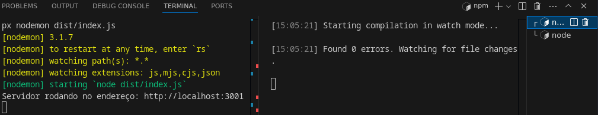

# Estudo Node.js

Material desenvolvido com base nas aulas da Ada.

## Execução

Necessário ter o **node** instalado.

Executar:

```
npm i # instalar dependências
```

```
tsc -w # retranspila o código fonte sempre que uma mudança for feita
```

```
npm run server # deve ser executado apenas ao subir um servidor, para que ele atualize a cada modificação no codigo
```

É interessante manter os dois últimos comandos rodando simultaneamente em terminais diferentes. Ex:



## Recursos

* Extensão para ver JSON no navegador: Json Viewer

* http status code: [https://developer.mozilla.org/en-US/docs/Web/HTTP/Status](https://developer.mozilla.org/en-US/docs/Web/HTTP/Status)

* Extensão do VS Code para fazer requisição: Thunder client

* Extensão do VS Code para executar JS de maneira mais simples: Code runnner